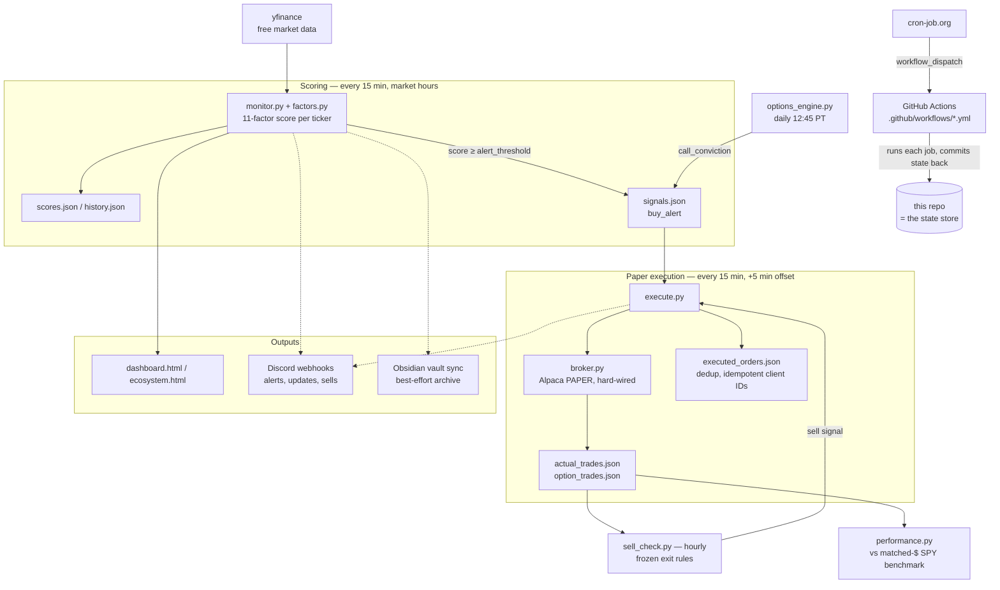

# How this system works

A third-party walkthrough of the whole ecosystem: what runs, when, what it
reads and writes, and where the boundaries are. For setup instructions see
the [README](../README.md); for the security model see
[SECURITY.md](../SECURITY.md) and [CLAUDE.md](../CLAUDE.md); for what data
is public vs. private see [DATA_CLASSIFICATION.md](DATA_CLASSIFICATION.md).

## The one-paragraph version

A watchlist of ~440 tickers is scored every 15 minutes during market hours
on momentum/trend factors (free yfinance data). Scores crossing a threshold
fire Discord BUY alerts and write `buy_alert` signals. A paper-trading
executor picks up fresh signals and places **fake-money** orders on an
Alpaca paper account, then applies frozen mechanical exit rules to the
positions it holds. Everything runs unattended on GitHub Actions (triggered
by an external cron service), and every run commits its updated JSON state
back to this repo — the repo itself is the database. No real money is
involved anywhere: `paper=True` is hard-wired ([broker.py](../broker.py)),
and the go-live bar is documented in
[LIVE_TRADING_READINESS.md](LIVE_TRADING_READINESS.md).

## Data flow

Dotted lines are best-effort side channels — their failure never blocks the
pipeline.

## The components, in the order data moves through them

### 1. Scoring — `monitor.py`, `factors.py`
Pulls free price data (yfinance) for every ticker in `config.json`'s
`watchlist` and computes a momentum/trend score (price vs 50-day SMA, 1/3
month returns, proximity to highs, RSI, volume). Diffs against the last run
(`scores.json`); a score crossing `alert_threshold` (currently 76) fires a
Discord BUY alert, records a `buy_alert` in `signals.json` (via
`signal_tracker.py`), and starts a per-ticker cooldown
(`alert_state.json`). `earnings_gate.py` suppresses buys too close to an
earnings date.

### 2. Signals ledger — `signals.json` (the machine book)
The handoff point between "the system said buy" and "something acted on
it," and the record used to score machine-signal hit-rate
(`signal_tracker.py`). Written by `monitor.py` (kind `buy_alert`) and
`options_engine.py` (kinds `call_conviction` / `etf_call_conviction`).
Consumed by `execute.py`. Distinct from `recommendations.json`, which holds
only human/committee verdicts (see §5).

### 3. Paper execution — `execute.py` → `broker.py`
Runs 5 minutes after each monitor run. For each fresh, not-yet-executed
signal it places a market order on an **Alpaca paper account** — fake money,
`paper=True` hard-wired in `broker.py` with no live code path. Guardrails:
kill switch, per-name anti-double-buy cap, buying power, trial end date
(2026-08-13, after which it flattens the book once and idles). Orders carry
deterministic client-order IDs so a crashed/retried run can never
double-submit, and every run reconciles broker positions (symbols and
quantities) against the ledger. Fills are appended to `actual_trades.json`
(stocks) / `option_trades.json` (options — kept separate so options never
contaminate the equity math), each stamped with SPY's price at fill time.

### 4. Exits — `sell_check.py` (+ the same rules inside `execute.py`)
Hourly. Applies frozen mechanical exit rules to open positions computed
from `actual_trades.json`: -15% stop-loss and 25% trailing stop (both armed
only while SPY > its 50-day SMA), an unconditional -30% disaster floor, and
a 365-day rebalance. `execute.py` imports the same constants — the rules
exist in one place and are considered frozen (`EVALUATION_PROTOCOL.md`).

### 5. Performance accounting — `performance.py`, `signal_tracker.py`
Three ledgers, deliberately never merged, each answering a different
question: `signals.json` (the machine book — what the algorithm flagged),
`recommendations.json` (the committee book — `committee_verdict` entries
from `verdict.py`, created on the first recorded verdict), and
`actual_trades.json` (the execution ledger — what actually got bought/sold).
`performance.py` reports the committee book and the execution ledger;
`signal_tracker.py report` scores the machine book. Each paper dollar is
benchmarked against the same dollar put into SPY at the same instant
(`spy_at_trade`), FIFO lot-matched — `execute.py --report` prints the
head-to-head and a daily equity curve of both routes.

### 6. Watchlist curation — `discover.py`, `watchlist_health.py`
Weekly (Saturdays). Sources candidates from free Yahoo screens and sector
lists, scores them with the same pipeline on a looser "worth watching?"
bar, auto-adds names into thematic categories, and prunes structurally dead
ones. Membership only — it never touches scoring or exit rules. Design in
`DISCOVERY.md`.

### 7. Committee pipeline — `committee.py`, `pulse.py`, `close.py`, `weekly.py`
When a score moves enough, a markdown payload is written to
`committee_prompts/` for a human to paste into a Claude Pro chat that acts
as an "investment committee"; verdicts are recorded back with `verdict.py`.
Deliberately manual — no LLM API calls anywhere in the pipeline. Protocol in
`COMMITTEE_PROTOCOL.md`.

### 8. Self-checks — `backtest.py`, `signal_tracker.py`, `alert_stats.py`
Saturday backtest: did the week's ratings actually predict the week's
returns (`backtest_log.json`)? The weekly review also tracks
machine-vs-committee signal quality.

### 9. Outputs — `notify.py`, `dashboard.py`, `ecosystem.py`, `obsidian.py`
All Discord posting goes through `notify.py` (three webhooks: buys,
updates, sells; output only — nothing polls Discord). `dashboard.html` is
the ranked scoreboard, `ecosystem.html` the full-metric dashboard, both
static and regenerated each run. `obsidian.py` mirrors everything into a
local Obsidian vault (queued via `obsidian_queue.jsonl` when running on CI,
replayed locally by `obsidian_sync.py`) — pure archive, best-effort.

## Scheduling: how it actually runs

GitHub's native `schedule:` triggers silently never fired on this repo
(new-account throttling), so an external scheduler — cron-job.org — POSTs to
each workflow's `workflow_dispatch` endpoint with a fine-grained PAT scoped
to this repo's Actions permission (details in `CRON_TRIGGERS.md`):

| Workflow | Schedule (PT, Mon–Fri) | Does |
|---|---|---|
| `monitor.yml` | every 15 min, 6:00–13:00 | score, alert, write signals |
| `execute.yml` | every 15 min, +5 min offset | paper-execute signals + exits |
| `sell_check.yml` | hourly 7:00–12:00 | exit checks on open positions |
| `pulse.yml` | hourly 7:00–12:00 | intraday committee pulse payload |
| `options.yml` | daily 12:45 | options-engine conviction scan |
| `close.yml` | daily 13:35 | closing-bell payload |
| `weekly.yml` | Friday 13:45 | weekly review payload |
| `backtest.yml` | Saturday 9:00 | scoring accuracy backtest |
| `discover.yml` | Saturday 9:30 | watchlist grow/prune |

Each workflow ends by committing an explicit allowlist (`STATE_FILES`) of
the JSON files it changed back to `main` — never `git add -A`
([CLAUDE.md](../CLAUDE.md#git-safety)). The next run pulls and continues.
A local Mac job only replays the Obsidian queue; nothing else runs locally.

## Boundaries a third party should know

- **Paper only.** No code path reaches real money. The conditions under
  which that could ever change are a 10-item gate in
  [LIVE_TRADING_READINESS.md](LIVE_TRADING_READINESS.md), not a flag.
- **Public by design.** Every tracked file is paper-trading state or code —
  classified file-by-file in [DATA_CLASSIFICATION.md](DATA_CLASSIFICATION.md).
  Credentials exist only in gitignored `secrets.json` locally or GitHub
  Actions secrets in CI.
- **Frozen rules.** Scoring thresholds and exit rules
  (`EVALUATION_PROTOCOL.md`) don't change mid-trial; the executor executes
  them, it doesn't tune them. The point of the trial (through 2026-08-13)
  is a clean, 100%-adherence track record vs SPY.
- **No paid dependencies.** yfinance, Discord webhooks, Alpaca paper, and
  GitHub Actions are all free tiers.

## Document map

| Doc | Covers |
|---|---|
| [README.md](../README.md) | Setup, forking, day-to-day usage |
| this file | Architecture and data flow |
| [CLAUDE.md](../CLAUDE.md) | Security & trading invariants (binding) |
| [SECURITY.md](../SECURITY.md) | Reporting, rotation runbooks |
| [DATA_CLASSIFICATION.md](DATA_CLASSIFICATION.md) | Public / internal / credential, per file |
| [LIVE_TRADING_READINESS.md](LIVE_TRADING_READINESS.md) | Go-live gate (future, not a build task) |
| `EVALUATION_PROTOCOL.md` | The frozen scoring & exit rules |
| `EXECUTION.md` | Paper executor design & trial terms |
| `DISCOVERY.md` | Watchlist discovery engine design |
| `COMMITTEE_PROTOCOL.md` | Manual Claude Pro committee workflow |
| `OPTIONS_ENGINE.md` | Options conviction-call scanner |
| `CRON_TRIGGERS.md` | External scheduling details |
